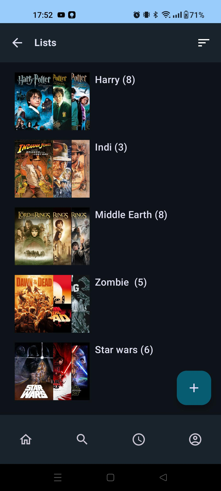

   

<h1 align="center">Logline - MovieApp</h1>

**Logline** is an open-source Android app that provides a seamless movie browsing experience with an emphasis on user privacy and transparency. 
The app offers core functionality to discover, organize, and rate movies while ensuring that user data remains under their control.

## Download

## Features
- **Discover Movies**: Explore popular, top-rated, and upcoming movies.
- **Search Functionality**: Find your favorite movies quickly.
- **Detailed Movie Information**: Access details about movies.
- **Watchlist**: Organize your movies by adding them to a personal watchlist.
- **Activity Tracking**: Keep a personal log of your watched movies.
- **Privacy First**: Local data storage ensures full control of your personal information.

## Screenshots

